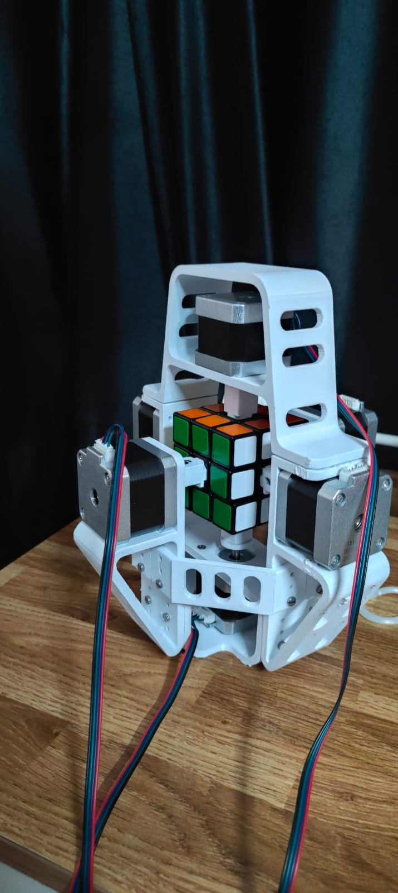

# Cube Solver System

## Overview

This project implements a **Reinforcement Learning-based Rubik’s Cube solver** integrated with:

* AI-based search and policy models
* Hardware execution (Master-Slave motor control)
* Configurable pipelines and logging

---

## Project Structure

```
project/
│── ai/          # CayleyPy-based AI logic (models, search, environment)
│── app/         # Entry point (main.py)
│── config/      # Configuration files (JSON)
│── hardware/    # Cube solver + Master-Slave motor control system
│── logs/        # Execution logs and outputs
│── models/      # Trained RL models (.pth files)
│── requirements.txt
│── .gitignore
```

---

## Components

### AI (`ai/`)

* Contains core logic for solving the cube

---

### Application (`app/`)

* `main.py` → Main entry point
* Connects AI + hardware + configs

---

### Config (`config/`)

* JSON-based configuration files
* Used for:

  * Model paths
  * Solver parameters
  * Hardware settings

---

### Hardware (`hardware/`)

* Stepper motor control
* Master-Slave Arduino communication
* Executes cube moves physically

---

### Models (`models/`)

* Stores trained `.pth` files
* Used by AI during inference

---

### Logs (`logs/`)

* Stores runtime logs and debugging outputs

---

## To Run

Run from project root:

```bash
python -m app.main
```

---

## Installation

```bash
pip install -r requirements.txt
```
## Hardware Components


The physical Rubik’s Cube solver is built using the following hardware components.

---

### Motors and Mechanical Structure

#### NEMA 17 Stepper Motors (x6)

Used to control each face of the cube independently with precise 90° rotations.

---

#### 3D Printed Chassis

Custom-designed frame that holds motors, cube, and structural components together.

---

#### Rubik’s Cube

Standard 3×3 cube used for solving.

---

#### Cube Adapters

Interfaces between motor shafts and cube faces.

---

#### Motor Sleeves


Ensures proper alignment and secure coupling between motors and adapters.

---

### Control Electronics

#### Arduino Boards (x2: Master and Slave)

- Master: Receives commands from the computer  
- Slave: Executes motor operations  

---

#### A4988 Stepper Drivers (x6)

Provides precise current control and microstepping for each motor.

---

#### CNC Shield V3.0 (x2)

Simplifies wiring and integration of multiple stepper drivers with Arduino.

---

### Power System

#### 4S Battery Pack


Supplies power to motors and drivers.

---

### System Overview

- Each motor controls one face: U, D, L, R, F, B  
- Master Arduino distributes commands to Slave Arduino  
- CNC shields handle driver interfacing  
- A4988 drivers control step precision and current  
- System performs discrete 90° rotations to execute solving algorithms  
---
